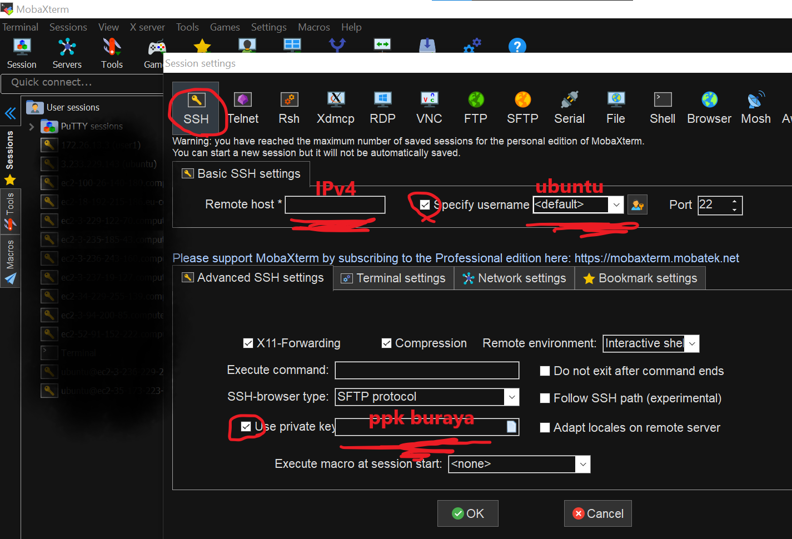

# Microkafka - EDA tabanlı mikroservis örneği

Bu kod örneğinde en basit haliyle bir olay tabanlı mikroservis uygulaması bulacaksınız. 

## Senaryo

Bir işe alım uygulaması geliştiriliyor. İşe giren kişinin ismi alındıktan sonra bu yeni işe başlayan NEWCOMER için aynı anda:
* Bir kullanıcı hesabı açılıp yetkiler veriliyor
* Kullanacağı bilgisayar ve malzemeler hazırlanıyor
* Bir ilk gün hediyesi hazırlanıyor ve masasına bırakılıyor
* Tüm bu işler tamamlandığında kişinin telefonu veya mailine şu isimde bir hesabın açıldığı, giriş bilgileri, masasında bilgisayarının hazır olduğu ve bir sürpriz hediyenin kendisini beklediği bilgisi gönderiliyor.

## Kurulum

### Altyapının ayağa kaldırılması

1- AWS'den Ubuntu 18.04 işletim sistemli en az 4vCpu - 16 GB Ram'ki bi sunucu kiralanır. Örneğin: t2.xlarge

2- 8 GB disk eklenir

3- Güvenlik ayarları tüm portlara izin verilecek şekilde ayarlanır. (Gerçek hayatta tavsiye etmiyoruz, sadece sorunsuz deneme için bu seferlik...)

4- Son aşamada yeni bir keyPair dosyası oluşturulur. Tip olarak PPK dosyası tercih edilerek keyPair dosyasına isim verilir ve dosya download edilir. (Bu dosya az sonra girişte lazım olacak)

5- Son butona bastıktan sonra sunucu listesinde sunucunun RUNNING konumuna geçmesi beklenir.

## Önemli Uyarı: Bu çalışmanı bittiğinde kiraladığınız bu sunucuyu lütfen kapatınız. Aksi takdirde ay sonunda binlerce dolarlık bir fatura ile karşılaşabilirsiniz. İş bittiğinde yapmanız gereken sunucuya sağl tıklatıp Terminate demeniz***

### Yazılımsal kurulumlar

1- Kiralanan sunucuya MobeXterm uygulaması ile SSH üzerinden bağlanılır. Bağlanırken bağlantı tipinin SSH, kullanıcı adının Ubuntu ve auth dosyası az önce indirdiğiniz PPK dosyası olacak şekilde giriş yapılır.



2- Ubuntu repo temizliği için aşağıdaki komut çalıştırılır:
```
sudo apt-get update
```
3- Docker kurulumu aşağıdaki komut ile yapılır. Kurulum esnasında gelen soruya Y cevabı verilerek ilerlenir:
```
sudo apt-get install docker.io
```
4- Docker kurulumunu kontrol etmek için aşağıdaki komut çalıştırılır. Ekrana boş bir tablo ve başlıklarının düşmesi beklenir:
```
sudo docker ps
```
4- Kafka kurulum komutu için sunucunun AWS konsolundan 'public IPv4' bilgisi alınır. Örneğin bu public IP'miz 11.22.33.44 ise aşağıdaki komutu hemen çalıştırmamız gerekir:
```
sudo docker run --rm --net=host -e ADV_HOST=11.22.33.44 lensesio/fast-data-dev
```
5- Bir 10 saniye bekledikten sonra Kafka kurulumunun kontrolü için daha önce aldığımız public IP'ye iki nokta üst üste Port no eklenerek bir tarayıcıdan url'i açarız. Örneğin IP'miz 11.22.33.44 ise Chrome veya Firefox'tan http://11.22.33.44:3030 adresini açmaya çalışırız. Gelen ekranda fast-data-dev'in Topics vb. başlıklarını görüyorsak sorun yok demektir.


### Kodun çalışma ortamına indirilmesi
1- Bu hazır ve henüz konfigüre edilmemiş proje kodunu çalıştığınız bilgisayara indirmek için 2 yönteme başvurabilirsiniz.
* Uğraşmak istemeyenler https://github.com/oceylantr/Microkafka sayfasındaki yeşil Code butonuna basarak projeyi Zip formatında indirebilir.
* Eğer sisteminizde Git varsa aşağıdaki komut yardımıyla proje kopyasını çekebilirsiniz:
```
git clone https://github.com/oceylantr/Microkafka.git
```
2- Uygulamayı denemek üzere bir IDE ihtiyacımız var. Bir Eclipse versiyonu yeterli olacaktır. Makinenizin 32-64 oluşuna veya özelliklerine göre aşağıdaki linkten uygun Eclipse'i indirebilirsiniz. Sayfa sizin için uygun bir indirme önerisi ile gelecektir.

Link: https://www.eclipse.org/downloads/

3- Eclipse açıldığında File menüsünde Open Existing Projects from Filesystem'a tıklanarak az önce proje kodunu indirdiğiniz dizin seçilir. Gelen listede alt projeleri göreceksiniz. En tepe proje dizini olan MicroKafka'nın seçimini kaldırarak, diğer tümü seçili şekilde ilerletebilirsiniz. O ekranı geçtiğinizde Eclipse'in Package Explorer'ında bu sayfadaki proje kırılımını görebileceksiniz.

### Servisleri çalıştırma
1- Servis kodlarında şu an yeni kurduğunuz Kafka'nın IP bilgisi yok. Servislerin Kafka'ya erişmesi için bazı app.properties dosyaları veya kodun içinde (ki siz kodun içine IP bilgisi koymayın hiç, ileride bunun properties'e çekicem) Kafka IP'lerinin güncellenmesi lazım. Aşağıdaki adreslerde Kafka IP'sini az önce aldığınız IP ile değiştirmeniz gerekiyor. Sonunda 2 nokta üst üste 9092 portunun kalmasına özen gösterelim. Kafka default bu porttan hizmet veriyor.

* Newcomer projesi / src / main / resources / application.properties dosyasında kafka.bootstrap.servers
* Aşağıdaki projelerde kod içinde props.put ile başlayan satırlarda sadece BOOTSTRAP_SERVERS_CONFIG key'ini içeren satırlardaki IP bilgisi değişecek. 9092 yi unutmayın, o kalacak.
  * Account projesi / src / main / java / com / oceylantr / account / stream / AccountSetStream.java
  * Account projesi / src / main / java / com / oceylantr / account / stream / PermissionSetStream.java
  * Gift projesi / src / main / java / com / oceylantr / gift / stream / GiftPlaceStream.java
  * Gift projesi / src / main / java / com / oceylantr / gift / stream / GiftPrepareStream.java
  * Hardware projesi / src / main / java / com / oceylantr / hardware / stream / HardwareOrderStream.java
  * Hardware projesi / src / main / java / com / oceylantr / hardware / stream / HardwarePlaceStream.java
  * People projesi / src / main / java / com / oceylantr / people / stream / PersonInfoStream.java
  * People projesi / src / main / java / com / oceylantr / people / stream / PersonLocateStream.java
  * SmartyMessage projesi / src / main / java / com / oceylantr / smartyMessage / stream / InformNewcomerStream.java

2- Her bir mikroservisin çalıştırılması için main application dosyalarının Run edilmesi gerekir. İlk event tetiğini yapacak servisin de, olayları okuyan consumer Stream servislerinin herbiri eksiksiz çalıştırılması. Aşağıdaki listedeki her bir dosyaya sağ tıklanıp, Run As diyerek Java Application seçilir ve çalıştırılır.

* Newcomer projesi / src / main / java / com / oceylantr / newcomer / NewcomerApplication.java
* Account projesi / src / main / java / com / oceylantr / account / stream / AccountSetStream.java
* Account projesi / src / main / java / com / oceylantr / account / stream / PermissionSetStream.java
* Gift projesi / src / main / java / com / oceylantr / gift / stream / GiftPlaceStream.java
* Gift projesi / src / main / java / com / oceylantr / gift / stream / GiftPrepareStream.java
* Hardware projesi / src / main / java / com / oceylantr / hardware / stream / HardwareOrderStream.java
* Hardware projesi / src / main / java / com / oceylantr / hardware / stream / HardwarePlaceStream.java
* People projesi / src / main / java / com / oceylantr / people / stream / PersonInfoStream.java
* People projesi / src / main / java / com / oceylantr / people / stream / PersonLocateStream.java
* SmartyMessage projesi / src / main / java / com / oceylantr / smartyMessage / stream / InformNewcomerStream.java

### Akış denemesi
1- Tarayıcınızdan http://localhost:8080/ajaxTest linkini çalıştırıp success mesajı aldığınızı görebiliyorsanız, ilk servis başarılı çalışmış demektir.

2- Yine tarayıcıdan http://localhost:8080/person/birinsanismi url'inin son kısmındaki birinsanismi yerine herhangi bir isim girerseniz, senaryodaki yeni işe başlayan kişinin ismi olacak. Akışın devamında bu kişiye bilgi gönderir gibi bilgilendirme ve aksiyonlar olacak.

3- Bu akış success aldığında daha önce aldığımız IP ile açtığımız Kafka ekranı açılır ve Topics tabında event_table topic'i incelenir.

4- Bir çok event mesajının topic'e düştüğüne ve en son event'in NEWCOMER_INFORMED tipinde olduğunu görebiliyorsak akış sona kadar başarılı ilerlemiştir.

5- Eğer en son event kaydında NEWCOMER_INFORMED'u göremiyorsak, bunun birkaç sebebi olabilir.
* Aradaki mikroservislerden birini çalıştırmamış olabiliriz.
* Ara mikroservislerden biri hata almış olabilir; ilgili servisin konsolunu incelemek gerekir. Hata var mı yok mu diye.
* İlk Newcomer projesindeki Producer ilk mesaj atılmamış olabilir.
